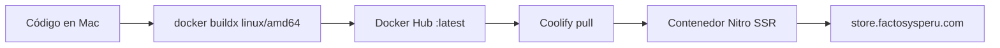

# Playbook: despliegue con Coolify + imagen Docker precompilada

Guía para **Factosys Store Web** (Nuxt SSR). Mismo patrón que FactoFarm / la API del store: **no compilar en el VPS**.

Ver también el playbook del API en el repo `factosys-store-api` → `docs/COOLIFY-DOCKER-DEPLOY.md`.

---

## Idea central

| Problema | Decisión |
|----------|----------|
| VPS pequeño: `nuxt build` satura CPU | **No construir en el VPS** |
| Coolify pack `dockerfile` + Git = build en el server | Pack **`dockerimage`**: solo `pull` + `run` |
| Tags de prueba | **Solo `latest`** |



---

## Recurso

| Campo | Valor |
|-------|--------|
| Imagen | `santossjba/factosys-store-web:latest` |
| URL | https://store.factosysperu.com |
| Puerto | `3000` (Nitro, no nginx) |
| Health | `GET /` |

A diferencia de FactoFarm (SPA + nginx :80), esta app es **Nuxt SSR**: la imagen corre Node y escucha en `3000`. Las vars `NUXT_*` / `NUXT_PUBLIC_*` se pasan en **Coolify runtime** (no hace falta `--build-arg` salvo que quieras hornear defaults).

---

## Coolify: cambiar a Docker Image

1. App `factosys-store-web` → Source / Build Pack → **Docker Image**
2. Image: `santossjba/factosys-store-web`, tag: `latest`
3. Ports Exposes: `3000`
4. Healthcheck: `/`, port `3000`
5. Env runtime (ejemplo):

```env
NODE_ENV=production
HOST=0.0.0.0
PORT=3000
NITRO_HOST=0.0.0.0
NITRO_PORT=3000
NUXT_PUBLIC_API_BASE_URL=/api
NUXT_API_PROXY_TARGET=https://api-store.factosysperu.com
NUXT_PUBLIC_API_ORIGIN=https://api-store.factosysperu.com
NUXT_PUBLIC_APP_NAME=Factosys Store
```

`NODE_ENV`: solo Runtime.

---

## Build + push

```bash
cd "/Users/santosjesusbernuiacevedo/Documents/PROYECTOS/FACTOSYS STORE/factosys-store-web"
./scripts/publish-image.sh
```

Luego en Coolify: **Deploy** (pull `latest`).

---

## Resumen

> **Compila Nuxt en la Mac → `santossjba/factosys-store-web:latest` → Coolify pull → HTTPS.**
